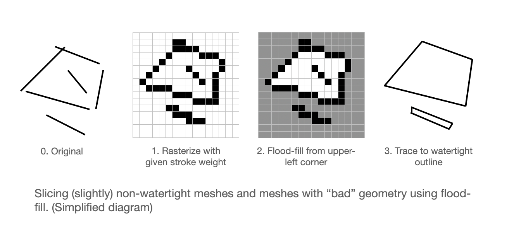

# t43

*Tools for 3D (printing)*

A tiny 3D slicer written from scratch, featuring:

- A commandline interface
- Slicing bad/messy meshes more robustly
- Detect and enlarge features/perimeters too small to print
- "Accentuate" outlines to make details stand out more
- Optimized toolpath to reduce need for retraction
- From mesh or voxels to gcode
- Wirtten in C99 with no dependencies


<sub>▲ *Test models sliced using t43 and printed on Ender 3 v1 with Overture Matte PLA light pink. 0.2mm layer height, 0.4mm nozzle, 220/60°C. US dime for size.*</sub>

## Usage

This toolkit consists of several standalone commandline programs. Each program can be compiled from a corresponding C file, independent of others. To compile all the programs with `gcc`, type

```
make
```

Or see the `Makefile` for the commands to compile each program separately.

Each of the program is responsible for a single task in the 3D slicing pipeline. For example, the `generate_support` command generates structural supports for a voxel model, and does not need to be executed if the model does not require supports.

Example usage, slicing an OBJ file and generating gcode:

```sh
# convert the mesh to voxels
./mesh_to_voxels dragon.obj -o dragon.bin --inv_flood 3 --fit_z 68 --swap_yz

# (optional) make details on the surface stand out more
./accentuate_voxels dragon.bin -o dragon-acc.bin --rate 7 --zero_sum

# (optional) generate supports
./generate_support dragon-acc.bin -o dragon-acc-sup.bin --sink 8 --hang 5 --ero_xy 5

# (optional) visual inspection (uses OpenGL)
./voxel_viewer dragon-acc-sup.bin

# output gcode from voxels, ready for 3D printing
./voxels_to_gcode dragon-acc-sup.bin -o dragon-acc-sup.gcode --config profiles/ender3.ini --step 3 --sink 18
```

Use `--help` option for each of the commands to see what each of the arguments does.

The Makefile in `example/` folder lists a lot more examples, both for slicing meshes (automated .obj download) as well as voxels (procedurally generated). To build all examples (will take a while): 

```sh
cd examples
make all
```

To build one particular example, e.g. `bunny`, `dragon`, etc.:

```sh
cd examples
make bunny
```

(Work in progress) [online gcode viewer](https://t43-gcode-viewer.glitch.me/)

## Some Features




Work in progress...

Explanatory blogpost coming soon...

## Gallery


More test prints coming soon...

## Known Limitations

- Slow
- Few error messages
- Tested on few hardware (Ender 3, Ender 3 V2)
